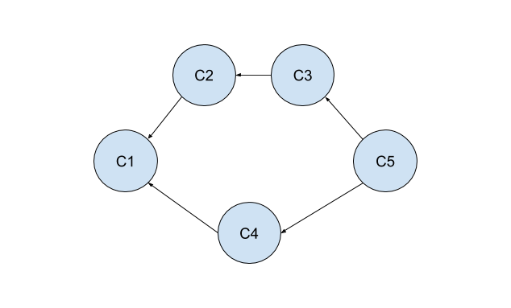
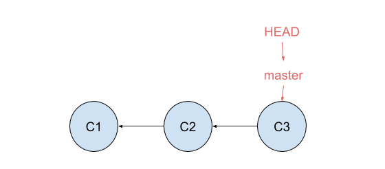
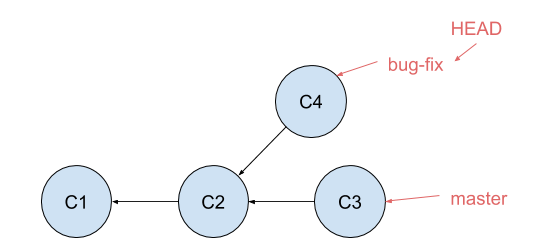

# Resources for learning `git`

These resources are a collection of my work, followed by a bunch of resources I found online, which can be used to learn Git and GitHub.

## Nick's Videos
1. [Git: The Command Line](https://www.loom.com/share/4a357b010e874d38b532f9a3ec86ef79) -- getting used to the command line, if that's new to you.
2. [Git: Working with Commits](https://www.youtube.com/watch?v=JDUtJdXav7M) -- Here, we learn about the "commit" the fundamental unit of Git.
3. [Git: Oh no, it's Vim!](https://www.loom.com/share/8b8b4bff4a984ac8bdb94a178cb9565e) -- Deals with a common situation where you accidentally open Vim, an in-terminal text editor. Vim is super useful! But, it's a bit overwhelming for new folks.
4. **Exercise** -- Now that you've seen the basics of the command line and git, I want you to make a repository that has exactly 4 commits in it.
5. [Git: Branches, Merges, and Checking Out](https://www.youtube.com/watch?v=qLbTBVNrWR8) -- Starts to show some of the power of Git.
  * Optional: [Learn Git in 15 minutes](https://www.youtube.com/watch?v=USjZcfj8yxE&source_ve_path=OTY3MTQ) -- this video is the best online source I've found to back up my videos above. Mine are a bit heavier on theory, which I think is helpful for something like Git because it doesn't have much visually that it shows you in the process.
6. **Exercise** -- Now, I'd like for you to make a particular git tree. (Meaning: make a git repository, and create commits such that the commit tree looks like as below.)
  
  How can you prove that this correct? _(Hint: it requires multiple uses of `git log`.)_
7. At this point, I recommend reading [The Git Parable](https://tom.preston-werner.com/2009/05/19/the-git-parable.html) (TW: alcoholism)
8. [Git: Merge Conflicts!](https://www.loom.com/share/7a9169d00e3342b28b0ed8938a2c4c67?t=0) -- Here, I intentionally create (and then resolve) a merge conflict, so y'all can see how.
9. [Git: Time Travel](https://www.loom.com/share/bb7b92746c394a319dcc6efe6f3e2f07?t=0) -- At this point, if you haven't already, I hope that you're starting to see how empowering Git is.
10. **Exercise** -- First, I'd like you to create a simple repository that has this git tree:
    
  Then, I'd like you to turn that respository into the following one, via time travel:
  
11. [Git: Remotes](https://www.youtube.com/watch?v=0qfLkj5zj3s) -- This video begins to use remote repositories to allow you to leverage Git as a tool to build code as part of an organization
12. [Git: Pushing Happens on Branches, Not Trees](https://www.loom.com/share/6232064f1710483881f2c3cc4a3d5dca?t=0) -- Clearing up a small misconceptions.
13. **Exercise** -- I want you now to practice a bunch with remotes:
  * `init` versus `clone`: You should make a git repository on your computer, create a remote for it (after having made it on your computer), and push code up to it. You should also make a repository on GitHub, clone it down, and figure out the difference. When would one method make more sense than another?
  * pushing: Make some changes to your code, and push up new changes. Verify that your remote repository is up to date with the local one afterward (and wasn't before!)
  * pulling: In order to practice pulling, we need to be a little bit clever. I want you to practice having the remote and local repositories being in different states, and then fixing it. Please create two repositories: one in which the local repository is "ahead" of the remote repository, and one in which the local branch is "behind" the remote repository. Then fix each one by pushing or pulling as appropriate (and confirm that they're now in sync). In thinking about that final point, you might be confused. How could you possibly have a remote branch that's ahead of your local branch if you're the only person editing the repository? Here are two ways you could set that up:
    1. You can edit files directly on GitHub: what effect does that have?
    2. You could have a local repository which you've cloned down to a totally different, second folder on your computer, which is purposefully going to be "old", then using the main (local) repository, you push up some new code. Now, the remote is ahead of the "old" version.
14. [GitHub: Forks and Pull Requests](https://www.youtube.com/watch?v=WYSGbC2cZUQ) -- This video covers the social aspect of GitHub, contributing to other repositories
15. [Git: A Full Open Source Contribution](https://www.youtube.com/watch?v=PPN3zMxNc60) -- This video is demonstrates a full Open Source contribution. Hopefully this process should make sense now!
16. [Finding and Fixing a scikit-learn bug](https://www.youtube.com/watch?v=1kA7oD7ftsM&t=88s) -- As a bonus, here's an amazing video where a software engineering hero of mine, Jake VanderPlas, discovers an error in Scikit-Learn, a famous open source Python library (to which he regularly contributes) at about 2 minutes into the video. He then LIVE STREAMS FIXING THE BUG (`#nerdswoon`). This video gives another example of a complete open-source software contribution.
17. **Exercise** -- OH NO! I made a typo in [this git repository](https://github.com/nzufelt/TYPO). Can you help me fix it? Please submit a pull request.

### OLD -- What Nick used to tell students
* Watch this [decent git video](https://youtu.be/Y9XZQO1n_7c?t=154) (starts after install information).  It's not perfect, but it will walk you through the basic commands.
* Read [The Git Parable](http://tom.preston-werner.com/2009/05/19/the-git-parable.html), a long blog post outlining the ideas behind `git` and why they exist.  It does a good job of demystifying `git` and convincing you that it is not something magical, that you could absolutely construct a (perhaps less optimized) version of `git` with enough time.
* Bookmark and glance through [The Git Book](https://git-scm.com/book/en/v2).  This is the main official-ish book on `git`.  This should be your reference for any specific questions you have about the tool.
* Glance through [Learn Git in 30 minutes](https://tutorialzine.com/2016/06/learn-git-in-30-minutes).  It's going to be repetitive from the previous items, so it's on you to decide how much repetition you need.  It's helpful to have this open in another window while you do the following:
* At this point, I believe that you just need to suffer through getting started with managing your own `git` repository, and learn by doing. There is plenty more to learn, but I don't think at this point you'll really feel ready to learn more until you have some experience.

### OLD -- Other resources
All of these tools are still not bad, but I feel like they aren't necessary.

* [Git from the inside out](https://codewords.recurse.com/issues/two/git-from-the-inside-out): This is my personal favorite resource for deeply learning and loving `git`.  It's intense, and requires you to dive into the internals of the tool, but I promise you will come out with a *much* stronger understanding of how `git` works.  This is not your very first introduction to `git`, though; you'll need to have seen the basic commands and have a rudementary understanding of their functionality first.
* [Think like (a) Git](http://think-like-a-git.net/sections/graphs-and-git.html): One thing I really like about this guide is the slow ramp-up pace. It takes the time to discuss how difficult it can be to learn git, and it also talks at length about graphs and why they are so important to understand first before learning git.
* [git - the simple guide ](http://rogerdudler.github.io/git-guide/): Yes, the author swears in this guide.  It's still a helpful resource.
* [Learn Git Branching](https://learngitbranching.js.org/): This is an interactive tool which is awesome for understanding the manipulation of source code graphs (Often called "source trees").  However, one thing it doesn't do is show when, where, and how the actual files in the respository are being editted.
* [Derek Banas video on `git`](https://youtu.be/r63f51ce84A?t=395) (starts after the intro, installation stuff): It's not how I would have organized the content, but it's not bad.
